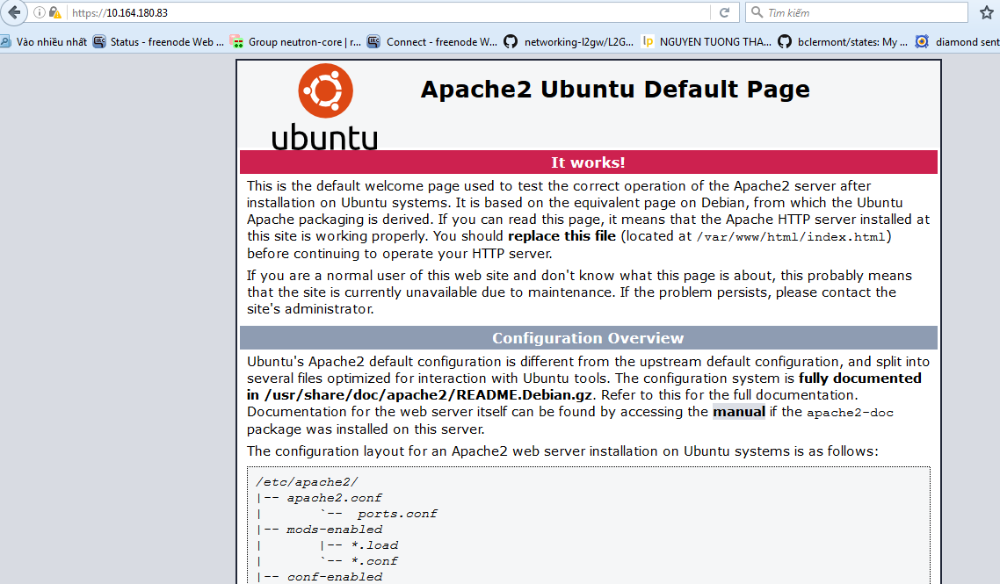

How To Create a SSL Certificate on Apache for Ubuntu 14.04
==========================================================

Prerequisites
-------------

You are also going to need to have Apache installed:

.. code-block:: console
    
    $ sudo apt-get update
    $ sudo apt-get install apache2

1. Activate the SSL Module
--------------------------

Enable SSL module by:

.. code-block:: console
  
    $ sudo a2enmod ssl

Restart apache2 service for updating the changes:

.. code-block:: console
  
    $ sudo service apache2 restart

2. Create a Self-Signed SSL Certificate
---------------------------------------

Create location where contains certificate files:

.. code-block:: console

   $ sudo mkdir /etc/apache2/ssl

Create the key and cerfiticate:

.. code-block:: console

    $ sudo openssl req -x509 -nodes -days 365 -newkey rsa:2048 -keyout /etc/apache2/ssl/apache.key -out /etc/apache2/ssl/apache.crt

More detail:

* **openssl**: cli tool which is provided by OpenSSl to create and manage key, cerfiticate, signing requests ...
* **req**: specifies a subcommand for X.509 certificate signing request (CSR) management. More detail for X.509 `here <https://en.wikipedia.org/wiki/X.509>`_.
* **-x509**:  specifies that we want to make a self-signed certificate file instead of generating a certificate request.
* **-nodes**: don't use passphrase for key file.
* **-day**: the number of days that key and cerfiticate are valid.
* **-newkey**: create the cerfiticate request and a new private key at the same time.
* **rsa:2048**: rsa key and 2048 bits.
* **-keyout**: output file where contain private key.
* **-out**: output file where contains cerfiticate.

3. Configure Apache to use SSL
------------------------------

configure your `/etc/apache2/sites-available/default-ssl.conf` file:

.. code-block:: ini

    <IfModule mod_ssl.c>
        <VirtualHost _default_:443>
            ServerAdmin admin@example.com
            ServerName your_domain.com
            ServerAlias www.your_domain.com
            DocumentRoot /var/www/html
            ErrorLog ${APACHE_LOG_DIR}/error.log
            CustomLog ${APACHE_LOG_DIR}/access.log combined
            SSLEngine on
            SSLCertificateFile /etc/apache2/ssl/apache.crt
            SSLCertificateKeyFile /etc/apache2/ssl/apache.key
            <FilesMatch "\.(cgi|shtml|phtml|php)$">
                            SSLOptions +StdEnvVars
            </FilesMatch>
            <Directory /usr/lib/cgi-bin>
                            SSLOptions +StdEnvVars
            </Directory>
            BrowserMatch "MSIE [2-6]" \
                            nokeepalive ssl-unclean-shutdown \
                            downgrade-1.0 force-response-1.0
            BrowserMatch "MSIE [17-9]" ssl-unclean-shutdown
        </VirtualHost>
    </IfModule>

4. Activate the SSL
-------------------

Enable ssl:

.. code-block:: console

    $ sudo a2ensite default-ssl.conf
    $ sudo service apache2 restart

5. Verification
---------------

Visit your server's domain name or IP with `https` protocol::

    https://server_domain_name_or_IP 

.. _figure_ssl_apache2_verification:

For more detail, please refer to `here <https://www.digitalocean.com/community/tutorials/how-to-create-a-ssl-certificate-on-apache-for-ubuntu-14-04>`_.
