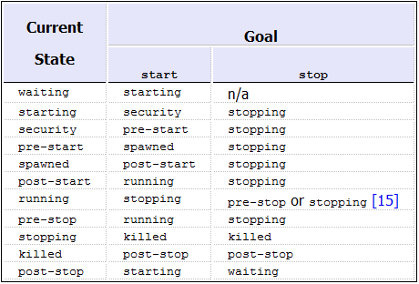

Upstart
=======

Upstart is an event-based replacement for the /sbin/init daemon which handles starting
of tasks and sevices during booting, stopping them during shutdown and supervising then
while the system is running.

Upstart provides the same facilities as traditional **init** system, but surpasses it in many ways.

Reliability
-----------

Reliability and safety is critically important for an `init` daemon since:

* It runs as a supper user.
* It is responsible for managing critical systems services.
* if init exits for any reason, the kernel panics.

Perfomance
----------

Upstart is high performance:

* It makes heavy use of the NIH utilitu Library which is optimised for the efficient early boot enviroments.
* Upstart's designe is lightweght, efficient and elegant.
* Upstart manages services running in parallel

Concepts and Terminology
========================

1 Job
------

A `unit of work` and is defined in `Job configuration file`.

1.1 Job type
~~~~~~~~~~~~

* Task Job: runs a shot-running process. For example, deleting a file.
* Service Job: is a long-running process and might nerver. For example: databse or FTP server.
* Abstract Job: ...

1.2 Job state
~~~~~~~~~~~~~

Job State Transitions:

.. _figure_job_states:

Details of states:

* `waiting` : initial state.
* `starting` : job is about to start.
* `security` : job is having its AppArmor security policy loaded (see apparmor load).
* `pre-start` : running pre-start section.
* `spawned` : about to run script or exec section.
* `post-start` : running post-start section.
* `running` : interim state set after post-start section processed denoting job is running (But it may have no associated PID!)
* `pre-stop` : running pre-stop section.
* `stopping` : interim state set after pre-stop section processed.
* `killed` : job is about to be stopped.
* `post-stop` : running post-stop section.

1.3 Job Enviroment
~~~~~~~~~~~~~~~~~~

When Upstart runs a job, needs 2 system variables:

* TERM
* PATH

If your `system job` nees further variables to be set, can use the `env` and `export` stanzas.

1.4 Job Configuration File
~~~~~~~~~~~~~~~~~~~~~~~~~~

A Job is defined in a Job Configuration File and are named ``<name>.conf``
Job configuration files can exist in two types of location, depending on whether they are a `system job` or a `User job`:

* **system job**: `/ect/init` by default. Can be overridden by `--confdir=<directory>`
* **user job**: `$HOME/.init` by default. Currently, not enabled on Ubuntu.

